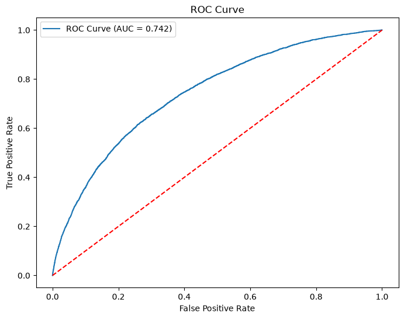

# Credit Risk & Default Prediction Model

## Project Overview
This project predicts whether a loan applicant is likely to default using Machine Learning.

The model is built using the Home Credit Default Risk dataset from Kaggle and Logistic Regression.

---

## Objective

To help financial institutions identify high-risk customers before approving loans.

---

## Dataset

The project uses the **Home Credit Default Risk** dataset available on Kaggle.

https://www.kaggle.com/competitions/home-credit-default-risk

---

## Workflow

1. Data Loading
2. Exploratory Data Analysis (EDA)
3. Missing Value Treatment
4. Categorical Encoding
5. Feature Scaling
6. Train-Test Split
7. Logistic Regression Model
8. Model Evaluation
9. ROC Curve Analysis
10. Feature Importance

---

## Technologies Used

- Python
- Pandas
- NumPy
- Matplotlib
- Scikit-learn
- Jupyter Notebook

---

## Model Performance

| Metric | Value |
|--------|-------|
| Model | Logistic Regression |
| Accuracy | 91.93% |
| ROC-AUC Score | 0.742 |
| Dataset | Home Credit Default Risk |
| Language | Python |

### ROC Curve



---

## Future Improvements

- Random Forest
- XGBoost
- Hyperparameter Tuning
- SMOTE for Imbalanced Data

---

## Project Structure

```
Credit-Risk-Default-Prediction-Model/
│
├── Credit_Risk_Prediction.ipynb   # Complete model development
├── credit_risk_model.pkl          # Trained Logistic Regression model
├── requirements.txt               # Required Python libraries
├── README.md                      # Project documentation
└── image/
    └── roc_curve.png              # ROC Curve
```
## Author

**Rishab Singh**
